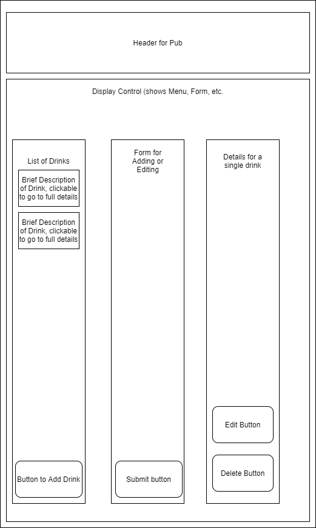
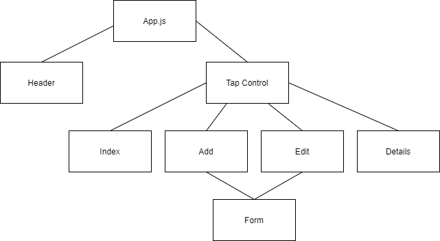

  

<h3 align="center">taproom</h3>

---

 An editable menu for a tap room. Features full Create-Read-Update-Destroy functionality.
      

## 📝 Table of Contents

- [About](#about)
- [Getting Started](#getting_started)
- [Deployment](#deployment)
- [Usage](#usage)
- [Components](#components-)
- [Built Using](#built_using)
- [Author](#author)
- [Acknowledgments](#acknowledgement)

## 🧐 About 

This is a single-page React app that uses state in order to track the changes that take place within a tap room. It should be capable of displaying a full list of drinks available, the amount remaining of each drink, details about each specific drink, and the ability to add and delete kegs from the list.

## 🏁 Getting Started 

These instructions will get you a copy of the project up and running on your local machine for development and testing purposes. See [deployment](#deployment) for notes on how to deploy the project on a live system.

### Prerequisites

If you wish to edit the code base or deploy the project on your machine, you'll need:
1. Node (or other package manager)
2. A terminal, such as GIT Bash or Windows Powershell
3. A code editor
4. Git (optional)

### Installing

1. Acquire the repo, by either clicking the download button or running `git clone https://github.com/Sudolphus/Tap-Room`
2. Install the packages. With Node, this can be done by navigating into the taproom directory and running `npm install`
3. To run the project, run `npm start`, which will load a development build in your browser.
4. Alternately, `npm run build` will create a build folder with a production build, which can then be opened in your browser. For other useful scripts, please see the [React Readme](React_README.md)

## 🎈 Usage 

To use the program, simply load it in your browser, by running the steps above to create a development or production build. Once it's in your browser, the links within in the app should default to a list of the drinks availabe (which will start empty), with a link to add drinks to the menu. Once a drink is added, it should be clickable, which will take you to a details page that contain more information about that drink, as well as links to edit the data for the drink, or remove the drink from the menu.

## 🚀 Deployment 

This project should be entirely self contained, so once the file is built, opening it in the browser should be all you need to do to deploy it.

## Components 

## ⛏️ Built Using 

- [NodeJs](https://nodejs.org/en/)
- [React](https://github.com/facebook/create-react-app)
- [Bootstrap](https://getbootstrap.com/)

## ✍️ Author 

- [Sudolphus](https://github.com/Sudolphus)

## 🎉 Acknowledgements 

- Thank you to [React-Bootstrap](https://react-bootstrap.netlify.app/) for the react-bootstrap package
- Thank you to [Christin Hume](https://www.christinhumephoto.com/) for the project logo image
